# Nama Aplikasi App - Flutter Application

<div align="center">
<url>
  
  </div>
<div align="center">
Institut Teknologi dan Bisnis Bina Sarana Global <br>
FAKULTAS TEKNOLOGI INFORMASI & KOMUNIKASI 
<br>
https://global.ac.id/
  </div>

  ##  Project UAS
  - Mata Kuliah : Aplikasi Mobile
  - Kelas : TISE23M
  - Semester : GANJIL 
  - Tahun Akademik: 2025 - 2026 
  
  Anggota: 
  - Dwi ilham maulana 1123150008
  - Sailendra Fas Faye 1123150198
  - M Ramzy HIdayat SIregar 1123150076
  - M ulin nuha 1123150008
  

## About The Project

NoteZy adalah aplikasi mobile modern yang dikembangkan menggunakan Flutter untuk membantu pengguna dalam mencatat tugas tugas harian, mingguan atau bahkan bulanan. dengan antarmuka yang mudah difahami, fiture sinkronisasi cloud menggunakan firebase autentication, supabase dan fitur cek realtime nontifikasi tugas.

# NoteZy

### About The Project

NoteZy adalah aplikasi mobile modern yang dikembangkan menggunakan Flutter untuk membantu pengguna dalam mencatat tugas-tugas harian, mingguan, atau bahkan bulanan. Dengan antarmuka yang mudah dipahami, fitur sinkronisasi cloud menggunakan Supabase, dan fitur cek real-time notifikasi tugas yang terintegrasi dengan Firebase Cloud Messaging (FCM).

### Key Features

- **Modern UI/UX Design** - Antarmuka yang clean, user-friendly, dan responsif.
- **Premium Intro Animation** - Animasi logo muncul dari bawah ke tengah disertai teks NoteZy yang memudar dari samping kiri selama 3 detik.
- **Smart Auth Persistence** - Pengecekan sesi login otomatis saat aplikasi dibuka; langsung masuk ke HomePage jika sesi masih aktif.
- **Push Notifications** - Reminder real-time untuk catatan dan tugas penting menggunakan Firebase Cloud Messaging.
- **Cloud Sync** - Sinkronisasi data otomatis dengan database Supabase agar data tetap aman dan terupdate.
- **Foreground Notification Handling** - Banner notifikasi tetap muncul secara pop-up meskipun pengguna sedang aktif menggunakan aplikasi.
- **Task Management** - Pengelolaan tugas harian, mingguan, hingga bulanan dengan sistem CRUD yang intuitif.
- **Media Attachment** - Kemampuan untuk menyisipkan gambar ke dalam catatan tugas menggunakan Image Picker.
- **Auto-Cleanup System** - Pembersihan otomatis token perangkat yang sudah tidak aktif melalui Supabase Edge Functions.

### Tech Stack

- **Framework** - Flutter (Dart)
- **Backend Database** - Supabase (PostgreSQL)
- **Authentication** - Supabase Auth
- **Push Notifications** - Firebase Cloud Messaging (FCM)
- **Serverless Logic** - Supabase Edge Functions (Deno / TypeScript)
- **Typography** - Google Fonts (Lobster & Poppins)
- **Local Notifications** - Flutter Local Notifications Plugin

### How to Run

1. Jalankan perintah `flutter pub get` untuk mengunduh semua dependensi.
2. Jalankan perintah `flutter run'

## Ini Adalah Flow dari aplikasi kami

<div align="center">
  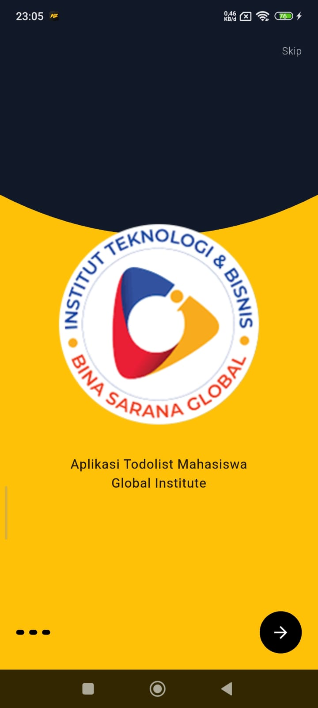
  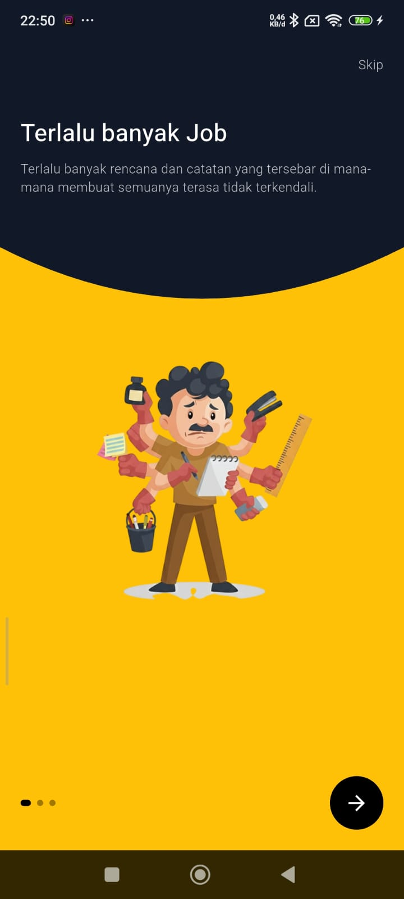
  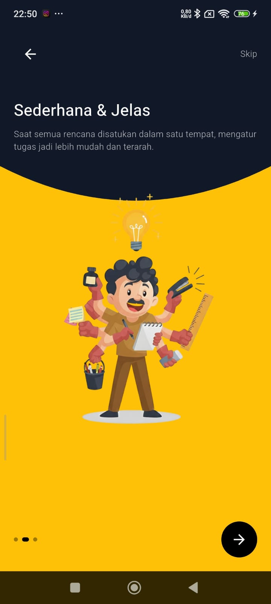
  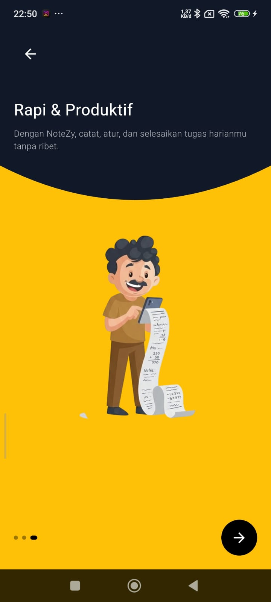
</div>
<div align="center">
  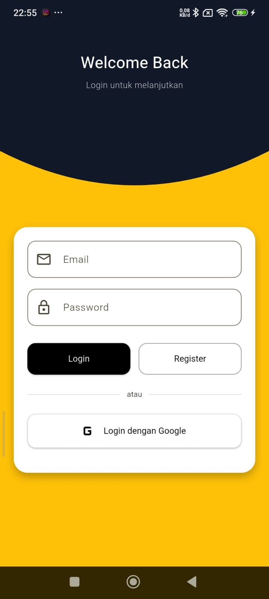
  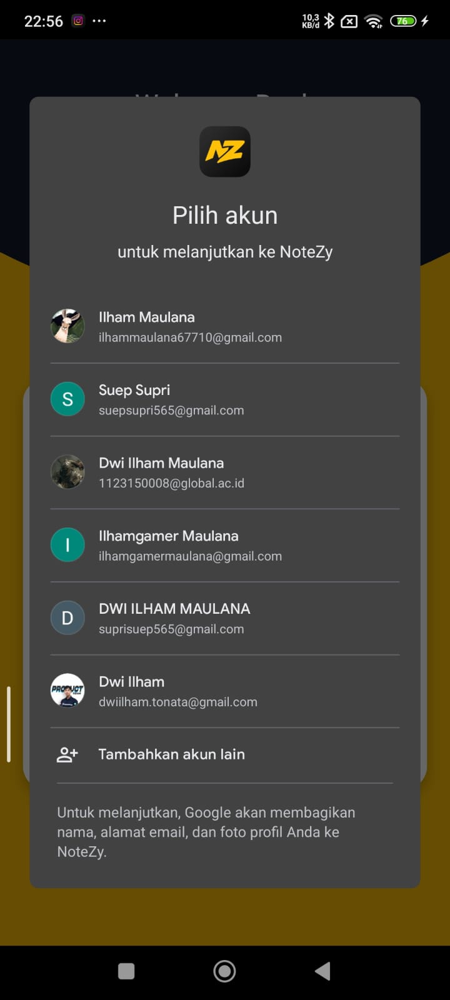
  
  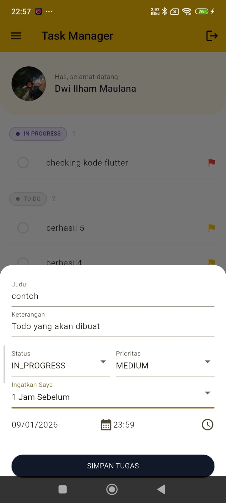

</div>
<div align="center">
  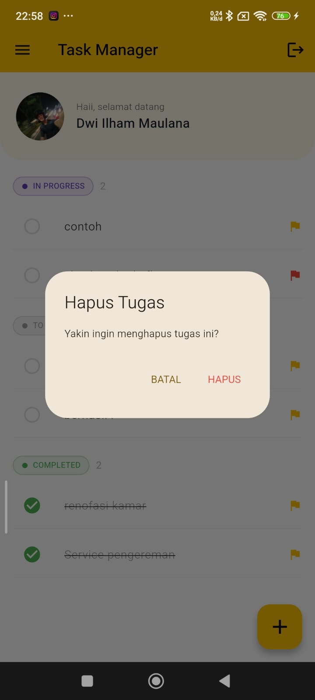
  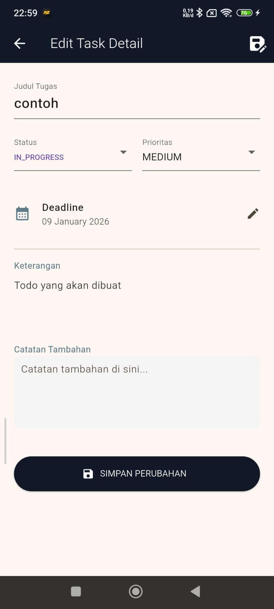
  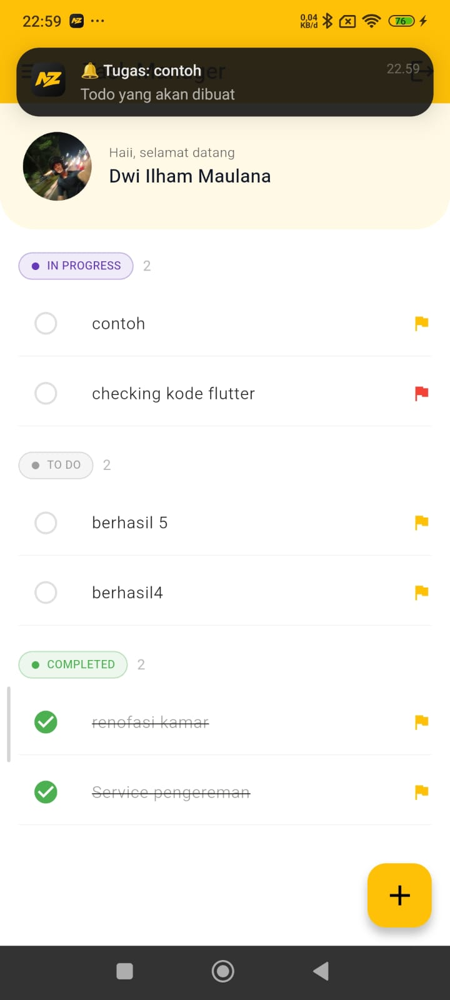
  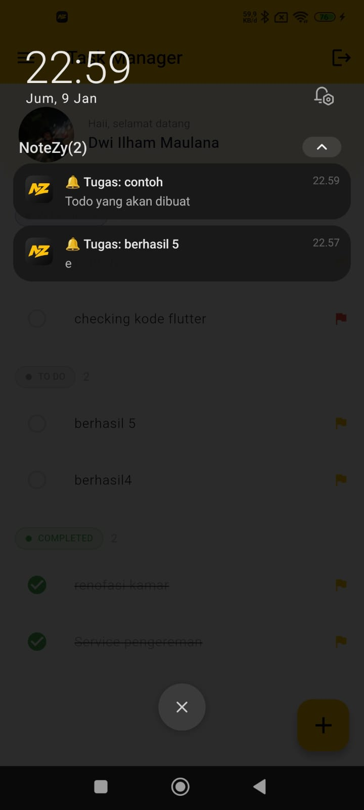
</div>

<div align="center">
  
  
</div>


## Demo Video

Lihat video demo aplikasi kami untuk melihat semua fitur dalam aksi!

**[Watch Full Demo on YouTube](https://youtu.be/j8aDZhhsk5A)**

Alternative link: **[Google Drive Demo](https://youtu.be/j8aDZhhsk5A)**

## Download APK

Download versi terbaru aplikasi Notes App:

### Latest Release v1.0.0
- [**Download APK (15.2 MB)**](https://github.com/yourusername/notes-app/releases/download/v1.0.0/notes-app-v1.0.0.apk)


**Minimum Requirements:**
- Android 6.0 (API level 23) or higher
- ~20MB free storage space

## Built With

- **[Flutter](https://flutter.dev/)** - UI Framework
- **[Dart](https://dart.dev/)** - Programming Language
- **[Firebase](https://firebase.google.com/)** - Backend & Authentication
- **[SQLite](https://www.sqlite.org/)** - Local Database
- **[Provider](https://pub.dev/packages/provider)** - State Management


## Getting Started

### Prerequisites

Pastikan Anda sudah menginstall:
- Flutter SDK (3.16.0 or higher)
- Dart SDK (3.2.0 or higher)
- Android Studio / VS Code
- Git

### Installation

1. Clone repository
```bash
git clone https://github.com/dwiilhammaulana/UAS_Mobile_App.git
cd notes-app
```

2. Install dependencies
```bash
flutter pub get
```

3. Setup Firebase
```bash
# Download google-services.json dari Firebase Console
# Place in android/app/
cp path/to/google-services.json android/app/
```

4. Run aplikasi
```bash
flutter run
```

### Build APK

```bash
# Debug APK
flutter build apk --debug

# Release APK
flutter build apk --release

# Split APK by ABI
flutter build apk --split-per-abi
```

## 📁 Project Structurelib/
├── models/
│   └── todo_model.dart
│
├── page/
│   ├── add_todo.dart
│   ├── home.dart
│   ├── intro.dart
│   ├── login.dart
│   ├── profile.dart
│   ├── profiledetail1.dart
│   ├── profiledetail2.dart
│   ├── profiledetail3.dart
│   ├── profiledetail4.dart
│   ├── splash_screen1.dart
│   ├── splash_screen2.dart
│   ├── splash_screen3.dart
│   ├── splash_screenglobal.dart
│   └── todo_detail.dart
│
├── services/
│   ├── auth_service.dart
│   ├── notification_service.dart
│   └── todo_service.dart
│
├── firebase_options.dart
└── main.dart


## Authentication Flow

```
1. Splash Screen (Auto-login check)
   ↓
2. Login Screen / Register Screen
   ↓
3. Home Screen (Dashboard)
   ↓
4. Profile & Settings
```

## 🗄️ Database Schema

### Notes Table
```sql
CREATE TABLE tableABC (
  id TEXT PRIMARY KEY,
  user_id TEXT NOT NULL,
  title TEXT NOT NULL,
  content TEXT,
  category_id TEXT,
  created_at INTEGER,
  updated_at INTEGER,
  is_synced INTEGER DEFAULT 0
);
```


## 📝 API Documentation

### Authentication Endpoints
- `POST /api/auth/register` - Register user baru
- `POST /api/auth/login` - Login user
- `POST /api/auth/logout` - Logout user
- `GET /api/auth/verify` - Verify token

### Development Workflow

1. Fork repository
2. Create feature branch (`git checkout -b feature/AmazingFeature`)
3. Commit changes (`git commit -m 'Add some AmazingFeature'`)
4. Push to branch (`git push origin feature/AmazingFeature`)
5. Open Pull Request

## Team Members & Contributions

### Development Team

| Name | Role | Contributions |
|------|------|---------------|
| **Asis** | Project Lead & Backend Developer | - Authentication system<br>- Firebase integration<br>- API development<br>- Database design |
| **Helen** | Frontend Developer | - UI/UX Design<br>- Home screen implementation<br>- Profile screen<br>- State management |
| **Rio** | Full Stack Developer | - Splash screen<br>- Register screen<br>- Notification system<br>- Push notifications (FCM) |
| **Adit** | Mobile Developer | - Login screen<br>- Local database (SQLite)<br>- Offline sync logic<br>- Testing & QA |


## 📄 License

This project is licensed under the MIT License - see the [LICENSE](LICENSE) file for details.


## Acknowledgments

- [Flutter Community](https://flutter.dev/community) - For amazing packages
- [Firebase](https://firebase.google.com/) - For backend services
- [Flaticon](https://www.flaticon.com/) - For app icons
- [Unsplash](https://unsplash.com/) - For placeholder images


---

<div align="center">
  <p>Made with by .... Team</p>
  <p>© 2026 Notes App. All rights reserved.</p>
</div>